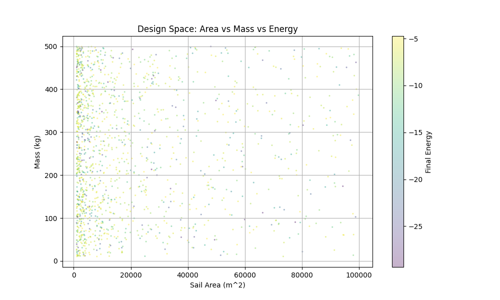
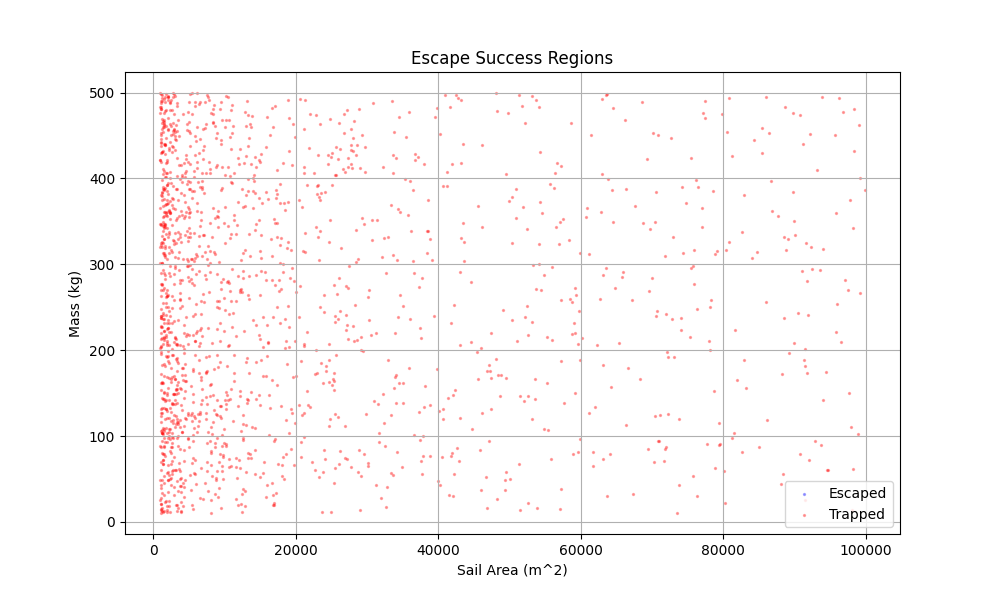
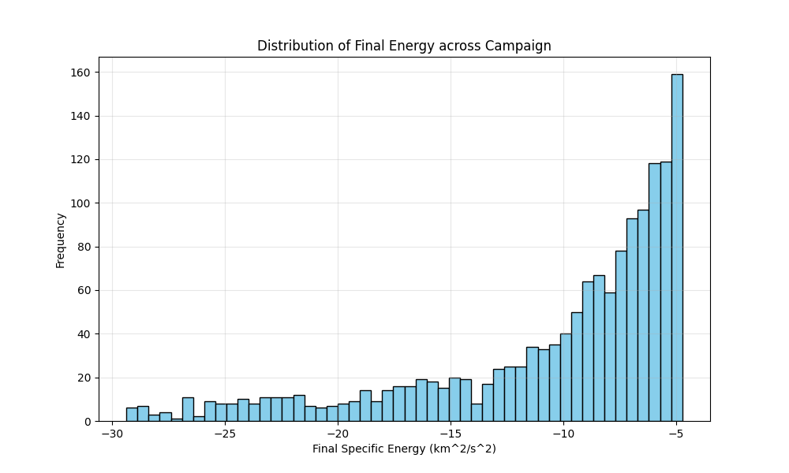
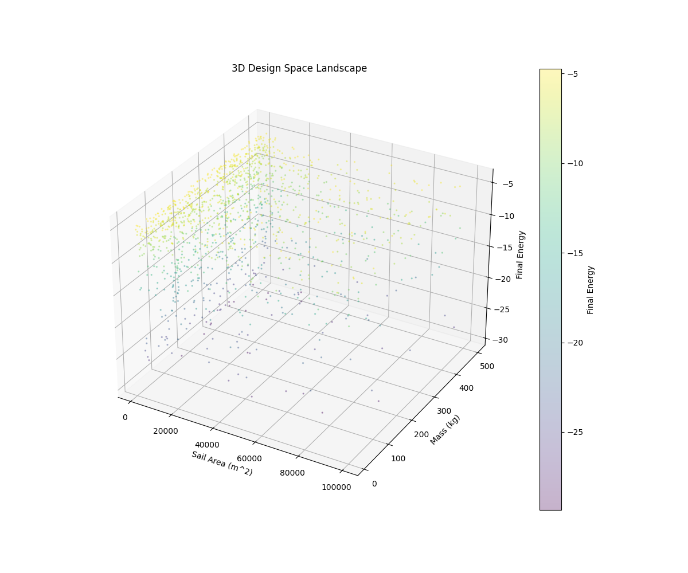
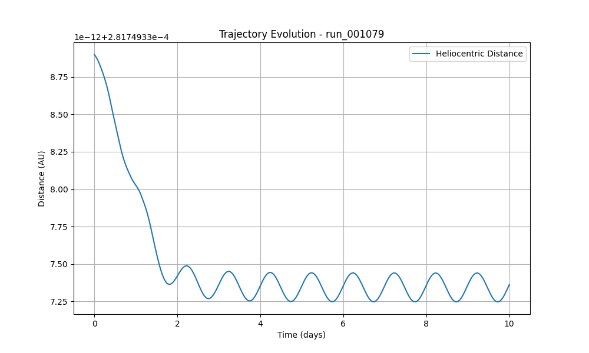
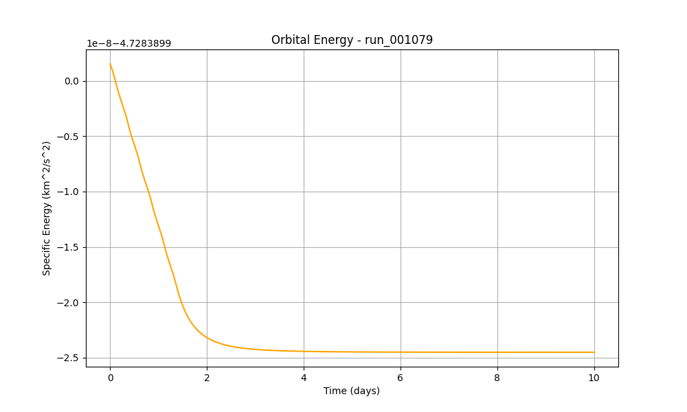
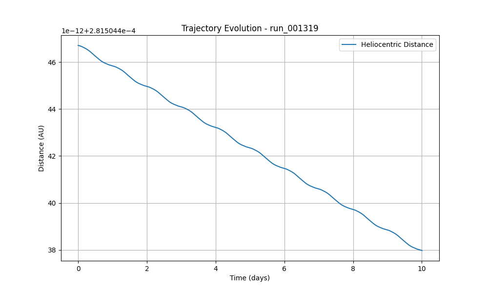
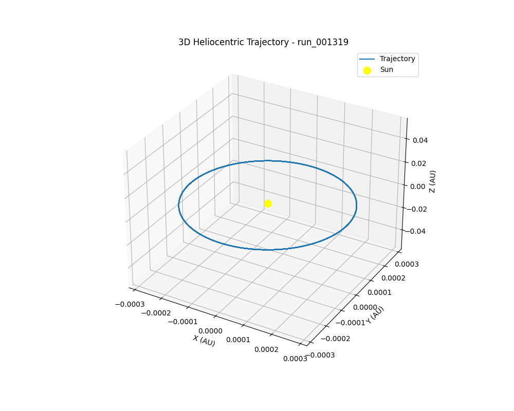
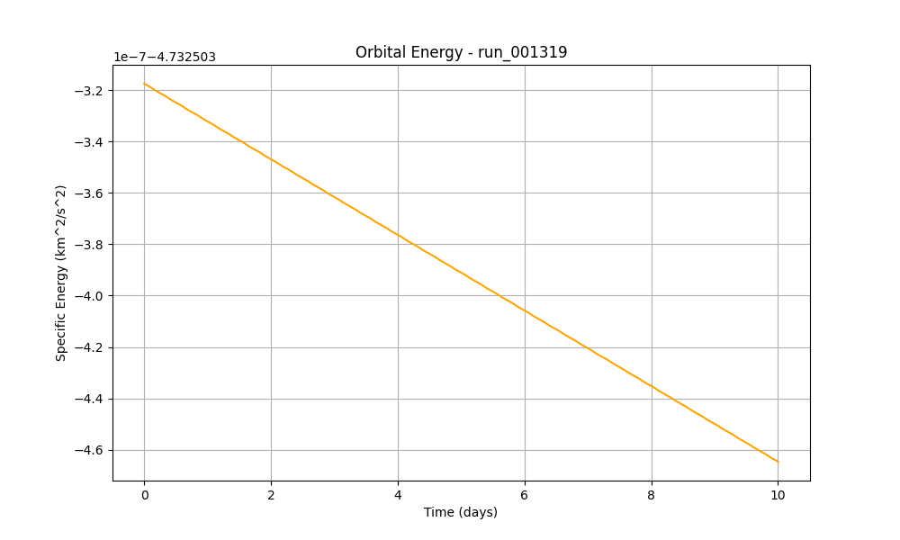

# Campaign Report: SolarSail_Research_Campaign_v1
**Date:** 2026-02-20 20:19

## 1. Executive Summary
- **Total Simulations:** 1707
- **Successful Escapes:** 0
- **Success Rate:** 0.0%

## 2. Design Space Analysis

## 3. Best Performing Missions
### Rank 1: run_001079
- **Final Energy:** -4.73e+00 J
- **Parameters:** Area=46700.085010696566 m², Mass=51.97770317644227 kg
- **Plots:**
  - 
  - 
  - 

### Rank 2: run_001191
- **Final Energy:** -4.73e+00 J
- **Parameters:** Area=2704.405354469603 m², Mass=137.1772434399423 kg
- **Plots:**
  - 
  - 
  - 

### Rank 3: run_001319
- **Final Energy:** -4.73e+00 J
- **Parameters:** Area=4845.406119657105 m², Mass=303.6940242508696 kg
- **Plots:**
  - 
  - 
  - 

_Generated by Auto-Reporting Engine_